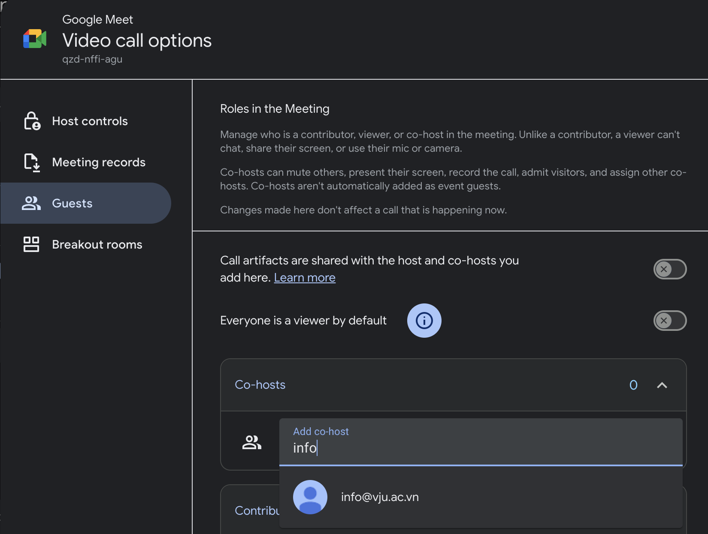
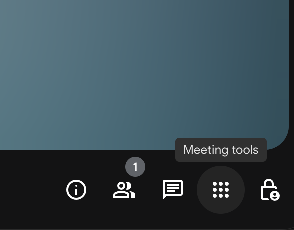

# Google Meet

This guide is for first-time Google Meet users. It walks through meeting creation, co-host configuration, app installation, link sharing, screen sharing, and breakout room management. Features that require Google Workspace Education (faculty edition) are called out explicitly.

## Roadmap
1. [Create a meeting in Google Calendar and set up co-hosts](#1-create-your-google-meet-in-google-calendar-and-assign-co-hosts)
2. [Install the Google Meet app on the required devices](#2-install-the-google-meet-app)
3. [Send the meeting link to your smartphone and run a connection check](#3-share-the-google-meet-url-with-your-smartphone-and-test-the-connection)
4. [Learn the essentials of screen sharing](#4-screen-sharing-workflow)
5. [Prepare breakout rooms and other advanced controls](#5-prepare-and-run-breakout-rooms)

Follow the steps in order and you will naturally complete all of the preparations needed before your session. If anything is unclear, jump back to the section that matches your objective.

## Goals
This document is designed to resolve the most common issues that arise when you start using Google Meet:
- Unsure how to configure meetings, especially recurring ones scheduled through Google Calendar.
- Do not know how to designate co-hosts ahead of time.
- Find screen sharing difficult to use and are not confident about what participants see.
- Have not installed the Google Meet app yet and do not know where to obtain it.
- Operate with only one computer/monitor and cannot confirm what full-screen sharing looks like to others.
- Spend too much time assigning students or participants to breakout rooms.

## Before You Begin
- Make sure your Google Account can access both **Google Calendar** and **Google Meet**.
- Use Google Chrome on your computer whenever possible. Chrome ensures the latest Meet features—screen sharing, captions, etc.—work reliably.
- Some organizations disable the co-host and breakout room features in the admin console. They are enabled for Vietnam-Japan University accounts, but double-check in other environments.

## 1. Create your Google Meet in Google Calendar and assign co-hosts
1. Open Google Calendar, click **Create** in the upper-left corner, and enter the title, date, time, and participants for the meeting.

You can also add a Google Group (mailing list). If you expect many attendees, ask your assistant for the appropriate group address.
2. In the event details panel, click **Add Google Meet video conferencing** to generate the meeting link automatically.
3. Click the gear icon next to the Meet link and open **Video conferencing settings**.

4. In the sidebar, choose **Guests**. Under **Co-hosts**, search for the people you want to promote and add them. Review the actions co-hosts are allowed to take (mute participants, start breakout rooms, etc.) and adjust as needed.

5. Confirm the notification settings for participants and click **Save**. Co-hosts receive meeting management privileges automatically.

> **Tip:** For recurring lectures or staff meetings, set the Calendar event itself to repeat (weekly, bi-weekly, etc.) so the Meet link stays consistent.
>
> **Tip:** The co-host feature is available with Google Workspace Education for faculty. If the option is missing, you might be signed in with a student license—contact IT support for assistance.

## 2. Install the Google Meet app

### Computer (Chrome browser)
- Visit [https://meet.google.com](https://meet.google.com) in Chrome and click the **Install** icon (down arrow) on the right side of the address bar.

- When prompted, click **Install**. The Google Meet progressive web app (PWA) is added so you can launch Meet directly from your Dock or taskbar.

### Smartphone
- **iPhone / iPad:** Search for “Google Meet” in the App Store and install the official app by Google LLC.
- **Android:** Open Google Play, search for “Google Meet,” and install the official app.
- On first launch, sign in with your Google Account and, when asked, allow access to the microphone and camera.

## 3. Share the Google Meet URL with your smartphone and test the connection
1. Open the Calendar event and click **Copy joining info** to copy the Meet URL and dial-in details.
2. Send the link to your smartphone using one of these methods:
   - **Gmail:** Email the link to yourself (add the meeting name to the subject line to keep it clear).
   - **Google Chat:** Paste the link into a direct message or space with yourself.
   - **SMS / messaging:** Text the link to your own phone number.
3. On your smartphone, tap the link to open the meeting in the Google Meet app or a mobile browser.
4. Test your microphone and camera. If something is not working, try restarting the device or switching networks. While you are at it, share a document from your computer and confirm on the phone how the screen looks to participants.

## 4. Screen-sharing workflow
1. After joining the meeting, click **Present now** on the bottom toolbar (older interfaces label this **Present**).
2. Choose what to share:
   - **Tab:** Share a single Chrome tab—best for video or audio playback.
   - **Window:** Share a specific application such as PowerPoint or Keynote.
   - **Entire screen:** Share everything on your display when you plan to switch between multiple apps.
3. During the presentation, a thumbnail or banner indicates your screen is live. When you are finished, click **Stop presenting**.
4. To include audio from a video clip, pick the Chrome tab option and select **Share tab audio** in the dialog.

- **Share a Chrome tab whenever you need to send audio:** In the Chrome sharing dialog, choose **Tab** and enable **Share tab audio**. Window or entire-screen sharing does not transmit sound, so queue any media in the tab you plan to present.
- **Preserve embedded audio in .pptx files:** Opening a .pptx directly from Google Drive converts it to Google Slides, which cannot play the embedded audio tracks. Upload the deck to OneDrive or open it in Microsoft 365 PowerPoint for the web instead, then present that browser tab with **Share tab audio** enabled.

> **Note:** If you frequently switch between Meet and other apps (Docs, Sheets, Slides) or present PDFs in full screen, installing the Google Meet app makes transitions smoother.

## 5. Prepare and run breakout rooms
1. While scheduling the meeting, open **Video conferencing settings** → **Create breakout rooms** to configure the number of rooms and their duration (available with Google Workspace Business Standard or higher).
2. Choose **Manually** to drag-and-drop participants into each room. For large classes, you can upload a CSV to assign people in bulk.
3. During the meeting, open **Meeting tools (Activities)** → **Breakout rooms** to start the activity, set timers, or move people between rooms. Co-hosts can perform the same actions.

4. When it is time to regroup, click **Bring everyone back to the main session** and leave a few minutes for debrief. Share follow-up notes or surveys so takeaways stick.

> **Hint:** Before launching breakout rooms, show participants where the **Return to main call** button is and remind them that the main chat stays visible even when they are in a breakout room.

## Common issues and quick fixes
- **Audio feedback or howling:** Mute every computer’s microphone and speaker, then re-enable them one at a time to find the source.
- **Microphone not recognized:** Ensure Meet itself is not muted and re-check Chrome’s microphone permissions from the lock icon in the address bar.
- **Camera not showing video:** Make sure no other app is using the camera and verify the correct device is selected in Meet settings.
- **Screen share is choppy:** Close unnecessary applications and confirm your network is stable. Use a wired LAN connection if possible.
- **Breakout rooms are unavailable:** Ask your Google Workspace administrator to confirm that the feature is enabled for your organizational unit.

## 6. Recording considerations

- Google Workspace for Education treats Meet recordings as “temporary recordings.” They automatically expire 30 days after the recording date. Move any critical footage to Classroom or another long-term storage location as soon as possible.
- Temporary recordings cannot be shared outside the organizer’s domain or downloaded, even within the 30-day window. Only people in the same domain as the host can view them.
- These constraints prevent unapproved redistribution of course content and help protect intellectual property. Document the policy in faculty guidelines and remind lecturers how to handle recordings responsibly.

## 7. Tips for successful sessions
- Configure Meet through Google Calendar so invitations and updates are sent automatically. Participants who accept the invitation receive reminders before the meeting.
- Install the desktop or mobile Meet app for a smoother experience, especially when presenting or switching windows frequently.
- Join the meeting from a smartphone as well as your computer to monitor how your slides, videos, and audio appear to others.
- Prefer tab sharing for the highest image quality, followed by window sharing, then entire-screen sharing.
- Set your Google Account display name appropriately so students and guests can recognize you.
- Use institutional accounts whenever possible. Some organizations block external addresses from joining, and attendance tracking works more reliably with managed accounts.

## References
- University of Tokyo utelecon, “Google Meet”: https://utelecon.adm.u-tokyo.ac.jp/google/meet/
- Carnegie Mellon University Computing Services, “Google Meet How-To”: https://www.cmu.edu/computing/services/comm-collab/web-conferencing/meet/how-to/index.html
- University of Cambridge UIS, “Google Meet” guide: https://help.uis.cam.ac.uk/google-meet
- Boston University TechWeb, “Google Meet for Remote Learning”: https://www.bu.edu/tech/services/cccs/collaboration/online/google-meet/meet-remote-learning/
- John Colet School, “A Student Guide to Using Google Meet for Online Tutorials”: https://www.johncolet.co.uk/assets/Uploads/A-Student-Guide-to-Using-Google-Meet-for-Online-Tutorials.pdf
- Georgetown University UIS, “Google Meet” support: https://uis.georgetown.edu/google-meet/