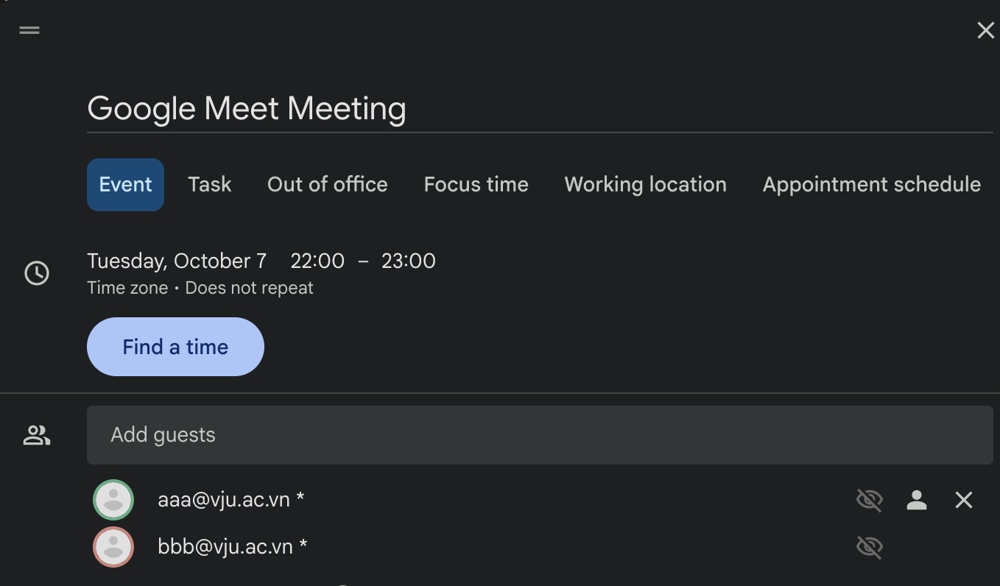
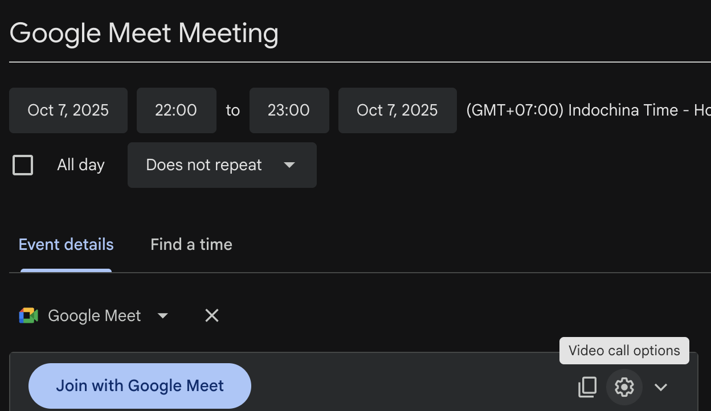
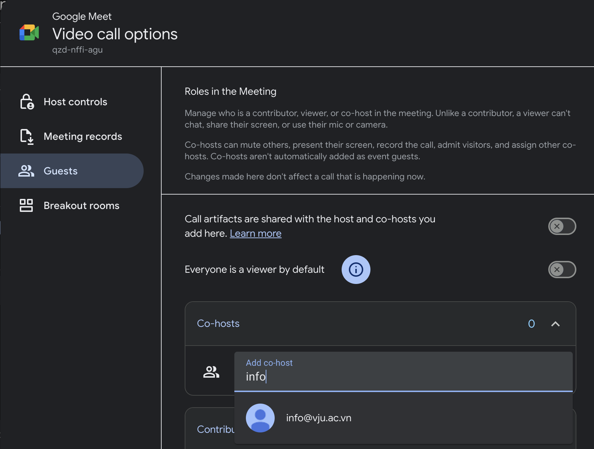
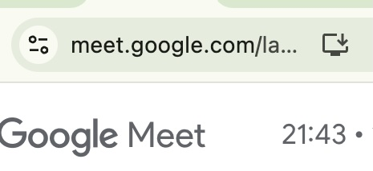
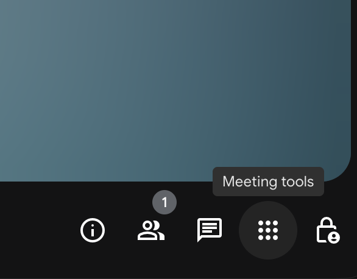
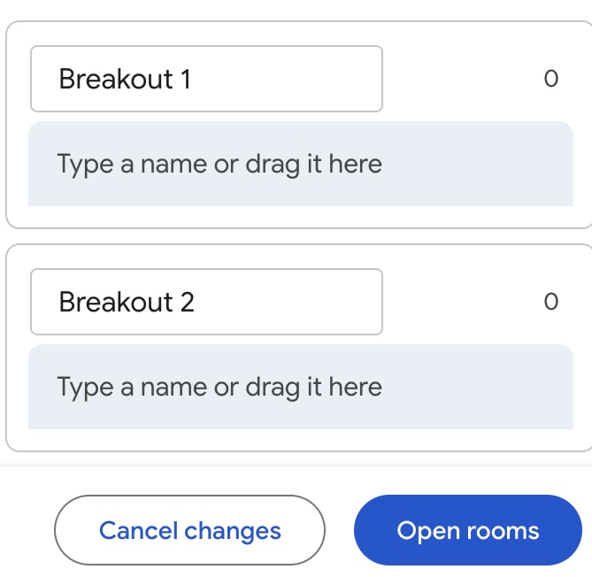

# Google Meet

Google Meet を初めて利用する方向けに、会議作成から共同主催者の設定、アプリのインストール、リンク共有、画面共有、ブレイクアウト ルームの活用までを丁寧にまとめました。Google Workspace Education（教員版）限定の機能にはその旨を明記しています。

## 目的
本書はGoogle Meetの基本的な使い方を説明する内容になっています。一通り目を通していただければ、Google Meetを使うに当たって課題となりうる次のような点は解消できるようになっています。
- Google Meet の設定方法、特に定期的な会議の設定方法が分かりません。
- Co-host を事前に設定する方法が分かりません。
- Google Meet での画面共有が使いづらいと感じています。
- Google Meet アプリのインストール方法が分かりません。
- パソコンが一台しかなく画面が一つしかないので、全画面共有時に相手からどのように見えているのか確認できません。
- ブレイクアウト ルームで学生を割り当てるのに時間がかかってしまいます。

## 全体の流れ
1. [会議を作成する。共同主催者を設定する。](#1-google-カレンダーで-google-meet-会議を作り共同主催者を設定する)
2. [必要な端末に Google Meet アプリをインストール](#2-google-meet-アプリをインストールする)
3. [会議リンクをスマートフォンへ共有し画面共有の見え方を確認](#3-google-meet-の-url-をスマートフォンに送り画面共有の見え方を確認する)
4. [ブレイクアウト ルームなどの高度な設定を準備](#4-ブレイクアウト-ルームブレイクアウト-セッションの使い方と事前設定)

各ステップは順番に実施すると、会議当日に必要な準備が自然と整うよう構成しています。疑問が生じた場合は、目的に対応するセクションへ戻って確認してください。

## 事前確認
- Google アカウントで **Google カレンダー** と **Google Meet** にアクセスできることを確認します。
- パソコンでは Google Chrome の利用を推奨します。画面共有や字幕など最新機能の動作が安定します。
- 組織の Google Workspace 管理者が共同主催者機能やブレイクアウト ルーム機能を無効化していることがあります。日越大学のアカウントの場合は有効化されているので問題ありませんが、他の環境で使うときには注意してください。

## 1. Google カレンダーで Google Meet 会議を作る。共同主催者を設定する。
1. Google カレンダーを開き、左上の **「作成」** をクリックして予定を作成します。タイトル・日時・会議時間、会議の参加者情報を入力します。

Google グループ (Googleのメーリングリスト)も指定することができますので、参加人数が多い場合はアシスタントさんに相談して、Google グループの情報を共有してもらいます。
2. 予定の詳細画面で **「Google Meet 会議を追加」** をクリックすると、会議リンクが生成されます。
3. Google Meetの右側に出てくる歯車のボタンから **「ビデオ会議の設定」** を開く。

4. ビデオ会議の設定のサイドバーから **「ゲスト」** を選択します。共同主催者に追加のセクションから共同主催者にしたいメンバーの Gmail アドレスを検索して追加し、必要に応じて **「共同主催者ができる操作」**（参加者のミュート、ブレイクアウト開始など）を確認します。

5. 参加者の通知有無を確認し、**「保存」** をクリックします。共同主催者には自動で会議管理権限が付与されます。

> **メモ:** 定例会議や講義のように定期的に開催されるミーティングの場合はGoogle カレンダーのイベントそのものを定期的な設定(毎週など)にします。

> **メモ:** 共同主催者機能は教員用 Google Workspace Education アカウントで利用できます。対象外のプランではホストしか会議管理ができません。もしも、設定できない場合は学生用アカウントになっている可能性があります。その場合は、ITサポートにご相談ください。

## 2. Google Meet アプリをインストールする

### パソコン（Chrome ブラウザ）
- Chrome で [https://meet.google.com](https://meet.google.com) を開き、アドレスバー右端の **「インストール」** アイコン（下向き矢印）をクリックします。

- 表示されたダイアログで **「インストール」** を押すと、Google Meet のプログレッシブ ウェブアプリ（PWA）が追加され、Dock／タスクバーからすぐに起動できるようになります。

### スマートフォン
- **iPhone / iPad:** App Store で「Google Meet」を検索し、Google LLC の公式アプリをインストールします。
- **Android:** Google Play で同様に「Google Meet」を検索し、インストールします。
- 初回起動時は Google アカウントでサインインし、マイクとカメラのアクセス許可を **「許可」** に設定します。

## 3. Google Meet の URL をスマートフォンに送り、画面共有の見え方を確認する
1. Google カレンダーの予定詳細を開き、**「参加に必要な情報をコピー」** をクリックして Meet の URL と電話番号情報をコピーします。
2. 以下のいずれかの方法で自分のスマートフォンへリンクを送ります。
   - **Gmail:** 自分宛てにメールを送信（件名に会議名を入れておくと便利）。
   - **Google Chat:** 自分とのスペースやチャットに貼り付けて送信。
   - **SMS／メッセージ:** 自分の電話番号にショートメッセージを送信。
3. スマートフォン側で受信したリンクをタップし、Google Meet アプリまたはブラウザで開きます。
4. マイク・カメラの動作に加えて、画面共有が想定どおり表示されるかを確認します。スマートフォンを参加させると、発表者画面と参加者画面を同時に把握できます。
5. パソコン側で下部ツールバーの **「今すぐ表示」**（旧 UI では「プレゼンテーションを開始」）をクリックし、共有範囲を選択します。
   - **タブ:** Chrome のタブを個別に共有。動画や音声共有に最適。最も高品質。
   - **ウィンドウ:** PowerPoint・Keynote など特定アプリだけを共有。
   - **画面全体:** 画面全体を共有し、アプリを切り替えながら説明したい場合に便利。
6. 共有開始後は、共有中であることを示すサムネイルやバナーが表示されます。不要になったら **「共有を停止」** をクリックし、スマートフォン側で表示が正しく切り替わったか確かめます。
7. 音声付き動画を流す際は Chrome のタブ共有を選び、ダイアログの **「このタブの音声を共有する」** にチェックを入れてから再生し、スマートフォンで音量と同期を調整します。

> **メモ:** Google Meetの画面とChromeの画面を頻繁に行き来する場合(Google Docs, Sheet, Slides)や、pdfなどを全画面共有する場合などはGoogle Meetアプリのインストールをしておくとスムーズになります。

## 5. 画面共有時の注意事項
- **音声を一緒に配信したい場合は「タブを共有」を選択する:** Chrome で共有メニューを開いたら「タブ」を選び、画面下部の **「タブの音声を共有」** に必ずチェックを入れます。ウィンドウ共有や全画面共有では音声が送れないため、動画や BGM を流したいときは事前に再生するタブを決めておきましょう。
- **Microsoft Office 内の音声を保持したい場合の手順:** Google Drive 上で .pptx を直接開くと自動的に Google スライドへ変換され、埋め込まれた音声が再生できなくなります。音声付きの .pptx を共有したいときは、あらかじめ OneDrive や Microsoft 365 の PowerPoint for the web にアップロードして開き、そのブラウザタブを「タブ共有＋音声共有」で配信してください。

## 4. ブレイクアウト ルーム（ブレイクアウト セッション）の使い方と事前設定
1. 会議をスケジュールする際に **「ビデオ会議の設定」→「ブレイクアウト セッションを作成」** を選択すると、会議前に部屋数と時間を設定できます。（Google Workspace Business Standard 以上）
2. **「手動」** を選択すると、参加予定者をドラッグ＆ドロップで各ブレイクアウト ルームに割り当てられます。参加者が多い場合は CSV の一括割り当ても活用できます。
3. 会議開始後は会議画面右下の **「ミーティングツール (もしくはアクティビティ)」→「ブレイクアウト セッション」** を開き、必要に応じて開始・タイマー設定・参加者の移動を操作します。共同主催者も同じ操作が可能です。

4. 集合タイミングになったら **「全員をメインセッションに戻す」** をクリックし、まとめの時間を確保します。終了後の振り返りメモやアンケートを共有すると学びを定着させやすくなります。

5. 事前に Google Slides でグループワーク用の資料を作成し、各チームが編集するスライドを分けておくと、ブレイクアウト ルーム中も進捗が把握しやすくなります。共有リンクは「リンクを知っている全員が編集可」に設定し、スライド1枚目にチーム分けと記入ルールを記載しておきましょう。

> **メモ:** ブレイクアウト ルームを利用する場合、参加者に「メインに戻る」ボタンの位置と、ブレイクアウト中でもメインチャットが確認できることを事前に案内しておくと安心です。

## 6. Google Meet 録画の注意事項

- Google Workspace for Education 環境では、録画は「一時的録画」として扱われ、録画日から30日が経過すると自動的に削除されます。重要な記録は Classroom など別の保管場所へ早めに移しておきましょう。
- 一時的録画は30日間の公開期間内であっても、主催者ドメイン外に共有したりダウンロードしたりすることはできません。共有相手は主催者と同じドメインに限定される点に注意してください。
- この制約は授業コンテンツの不当な再配布を防ぎ、知的財産を保護する運用的役割を果たしています。大学としてはガイドラインに明記し、教員へ録画データの適切な扱いを周知することで、外部流出リスクの最小化につなげましょう。

## 7. よくあるトラブルと解決のヒント
- **ハウリングする :** 一旦全てのパソコンのマイクとスピーカーをオフにしてください。その後に、一つずつオンにしてみてください。
- **マイクが反応しない:** Meet 画面でミュートになっていないか確認し、ブラウザのマイク権限を再確認します。Chrome アドレスバー右側の鍵アイコンから設定できます。
- **カメラが映らない:** 他アプリでカメラを使用していないか、Meet の設定でカメラデバイスが正しく選ばれているかを確認します。
- **画面共有がカクつく:** 不要なアプリを閉じ、ネットワークが安定している状態で再共有します。必要があれば有線 LAN を利用しましょう。
- **ブレイクアウト ルームが使えない:** 組織の Google Workspace プランと機能権限を管理者に確認します。

## 8. Google Meet 利用のポイント

- Google Meetの設定はGoogle カレンダーから行いましょう。(拒否しない限り)通知が自動的に送られますので、参加者への連絡が不要になります。また、繰り返しのイベントも設定できますし、予定変更時も自動で通知を送ることができるので簡便です。インビテーションを受諾した参加者には、開始前にリマインドがあるので、参加率向上にも繋がります。
- アプリをインストールしましょう。ブラウザだけでも画面共有などはできますが、アプリとしてインストールすると利便性が向上します。
- スマートフォンを活用しましょう。パソコンとスマートフォンを利用することで、相手にどのように見えているのか自分で確認することができます。
- 画面共有の際はタブの共有を優先しましょう。タブの共有の画質が最も高く、次にウィンドウ、最後に全画面共有です。
- Google アカウントの名前は適切に設定しましょう。
- 公式のアカウントを活用しましょう。場合によっては、外部のメールアドレスではGoogle Meetに参加できない設定にしている可能性がありますし、外部のメールアドレスでは誰が参加していたのか把握できません。
- 大人数の講義ではティーチング・アシスタントを共同主催者に設定し、チャット欄での質問対応やトラブル報告の一次窓口を任せましょう。教員が講義に集中しながら、参加者の疑問をリアルタイムに拾い上げることができます。

## 参考文献
- 東京大学 utelecon「Google Meet」設定マニュアル: https://utelecon.adm.u-tokyo.ac.jp/google/meet/
- Carnegie Mellon University Computing Services「Google Meet How-To」: https://www.cmu.edu/computing/services/comm-collab/web-conferencing/meet/how-to/index.html
- University of Cambridge UIS「Google Meet」ガイド: https://help.uis.cam.ac.uk/google-meet
- Boston University TechWeb「Google Meet for Remote Learning」: https://www.bu.edu/tech/services/cccs/collaboration/online/google-meet/meet-remote-learning/
- John Colet School「A Student Guide to Using Google Meet for Online Tutorials」: https://www.johncolet.co.uk/assets/Uploads/A-Student-Guide-to-Using-Google-Meet-for-Online-Tutorials.pdf
- Georgetown University UIS「Google Meet」サポート: https://uis.georgetown.edu/google-meet/