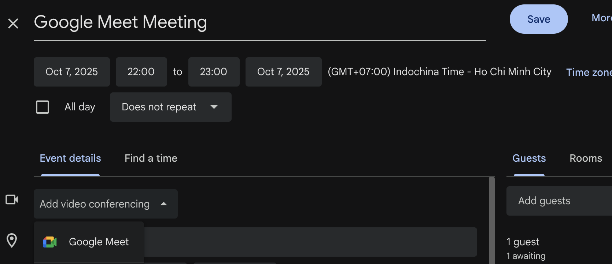
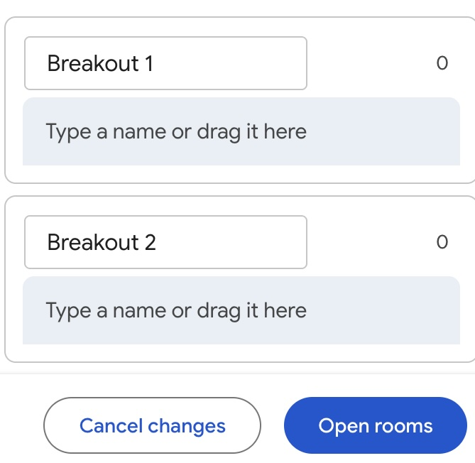

# Google Meet

Tài liệu này dành cho người mới bắt đầu sử dụng Google Meet. Nội dung hướng dẫn quy trình tạo lịch họp, cấu hình đồng chủ trì, cài đặt ứng dụng, chia sẻ đường dẫn, trình chiếu màn hình và vận hành phòng thảo luận (breakout room). Những tính năng chỉ khả dụng trên Google Workspace Education (phiên bản dành cho giảng viên) đều được ghi chú rõ.

## Lộ trình tổng quát
1. [Tạo cuộc họp trong Google Calendar và gán đồng chủ trì](#1-tao-cuoc-hop-trong-google-calendar-va-gan-dong-chu-tri)
2. [Cài đặt ứng dụng Google Meet trên các thiết bị cần thiết](#2-cai-dat-ung-dung-google-meet)
3. [Gửi đường dẫn cuộc họp tới điện thoại và kiểm tra kết nối](#3-gui-duong-dan-google-meet-toi-dien-thoai-va-kiem-tra-ket-noi)
4. [Nắm vững quy trình chia sẻ màn hình](#4-quy-trinh-chia-se-man-hinh)
5. [Chuẩn bị và vận hành breakout room](#5-chuan-bi-va-van-hanh-breakout-room)

Thực hiện lần lượt các bước trên sẽ giúp bạn hoàn tất phần chuẩn bị trước giờ họp một cách tự nhiên. Khi có điều chưa rõ, hãy quay lại mục tương ứng để xem chi tiết.

## Mục tiêu hỗ trợ
Tài liệu tập trung giải quyết những vướng mắc phổ biến khi bắt đầu dùng Google Meet:
- Chưa rõ cách cấu hình cuộc họp, đặc biệt là lịch họp định kỳ tạo từ Google Calendar.
- Không biết cách chỉ định đồng chủ trì (co-host) từ trước.
- Chưa tự tin về thao tác chia sẻ màn hình và về việc người tham dự nhìn thấy gì.
- Chưa cài đặt ứng dụng Google Meet và không biết tải ở đâu.
- Chỉ có một máy tính/màn hình nên khó kiểm tra giao diện khi trình chiếu toàn màn hình.
- Mất nhiều thời gian phân công sinh viên hoặc người tham dự vào breakout room.

## Chuẩn bị trước
- Đảm bảo tài khoản Google của bạn truy cập được **Google Calendar** và **Google Meet**.
- Trên máy tính, nên dùng trình duyệt Google Chrome để các tính năng mới như chia sẻ màn hình hay phụ đề hoạt động ổn định.
- Một số tổ chức có thể tắt chức năng đồng chủ trì hoặc breakout room ở cấp quản trị. Tài khoản Trường Đại học Việt-Nhật (VNU – Vietnam-Japan University) đã bật sẵn, nhưng khi dùng ở môi trường khác bạn nên kiểm tra trước.

## 1. Tạo cuộc họp trong Google Calendar và gán đồng chủ trì
1. Mở Google Calendar, nhấp **"Tạo"** ở góc trên bên trái rồi nhập tiêu đề, ngày giờ, thời lượng và danh sách người tham dự.

Bạn cũng có thể thêm Google Group (danh sách thư). Nếu số lượng người tham dự lớn, hãy trao đổi với trợ lý để lấy địa chỉ nhóm phù hợp.
2. Trong phần chi tiết, nhấp **"Thêm hội nghị Google Meet"** để hệ thống tạo sẵn đường dẫn.
3. Mở **"Cài đặt hội nghị"** và chọn **"Thêm đồng chủ trì"**.
4. Tìm địa chỉ Gmail của đồng chủ trì và kiểm tra những quyền mà đồng chủ trì có thể sử dụng (tắt micro người tham dự, mở breakout room...).

5. Kiểm tra cách gửi thông báo cho người tham dự rồi nhấp **"Lưu"**. Quyền quản lý cuộc họp sẽ tự động được cấp cho đồng chủ trì.

> **Lưu ý:** Với các buổi họp hoặc lớp học định kỳ, hãy đặt sự kiện Calendar ở chế độ lặp (hàng tuần, hai tuần một lần...) để giữ nguyên đường dẫn Meet.
>
> **Lưu ý:** Tính năng đồng chủ trì chỉ có trên Google Workspace Education bản dành cho giảng viên. Nếu không thấy tùy chọn này, rất có thể bạn đang đăng nhập bằng tài khoản sinh viên – hãy liên hệ bộ phận IT để được hỗ trợ.

## 2. Cài đặt ứng dụng Google Meet

### Máy tính (trình duyệt Chrome)
- Mở [https://meet.google.com](https://meet.google.com) trong Chrome và nhấp biểu tượng **"Cài đặt"** (mũi tên xuống) ở cuối thanh địa chỉ.

- Khi hộp thoại xuất hiện, chọn **"Cài đặt"**. Ứng dụng web tiến tiến (PWA) của Google Meet sẽ được thêm vào, cho phép mở Meet trực tiếp từ Dock hoặc thanh tác vụ.

### Điện thoại thông minh
- **iPhone / iPad:** Tìm “Google Meet” trên App Store và cài ứng dụng chính thức của Google LLC.
- **Android:** Tìm “Google Meet” trên Google Play và cài đặt ứng dụng chính thức.
- Lần mở đầu tiên, đăng nhập bằng tài khoản Google và chọn **"Cho phép"** khi được hỏi quyền truy cập micro và camera.

## 3. Gửi đường dẫn Google Meet tới điện thoại và kiểm tra kết nối
1. Trong sự kiện Calendar, chọn **"Sao chép thông tin tham gia"** để lấy đường dẫn Meet và thông tin quay số.
2. Gửi đường dẫn sang điện thoại bằng một trong các cách sau:
   - **Gmail:** Tự gửi email cho mình (nên ghi tên cuộc họp trong tiêu đề).
   - **Google Chat:** Dán đường dẫn vào cuộc trò chuyện hoặc không gian do chính bạn tạo.
   - **SMS/Tin nhắn:** Gửi tin nhắn văn bản tới số điện thoại của bạn.
3. Mở đường dẫn trên điện thoại bằng ứng dụng Google Meet hoặc trình duyệt di động.
4. Kiểm tra micro và camera. Nếu gặp lỗi, hãy thử khởi động lại thiết bị hoặc chuyển mạng. Đồng thời, chia sẻ thử tài liệu từ máy tính để xem trên điện thoại người tham dự đang nhìn thấy gì.

## 4. Quy trình chia sẻ màn hình
1. Sau khi tham gia cuộc họp, nhấp **"Trình bày ngay"** trên thanh công cụ phía dưới (giao diện cũ hiển thị là **"Trình bày"**).
2. Chọn phạm vi muốn chia sẻ:
   - **Thẻ (Tab):** Chia sẻ một thẻ Chrome – phù hợp nhất khi phát video hoặc âm thanh.
   - **Cửa sổ (Window):** Chia sẻ riêng một ứng dụng như PowerPoint hoặc Keynote.
   - **Toàn màn hình (Entire screen):** Chia sẻ toàn bộ màn hình khi cần chuyển qua nhiều ứng dụng.
3. Trong quá trình trình chiếu, Meet hiển thị thông báo hoặc hình thu nhỏ cho biết bạn đang chia sẻ. Khi kết thúc, nhấp **"Dừng trình bày"**.
4. Nếu cần chia sẻ video có âm thanh, hãy chọn chế độ chia sẻ thẻ Chrome và đánh dấu vào **"Chia sẻ âm thanh của thẻ"**.

> **Ghi chú:** Nếu thường xuyên chuyển qua lại giữa Meet và các ứng dụng khác (Google Docs, Sheets, Slides) hoặc trình chiếu PDF toàn màn hình, bạn nên cài ứng dụng Google Meet để thao tác mượt hơn.

## 5. Chuẩn bị và vận hành breakout room
1. Khi lên lịch, mở **"Cài đặt hội nghị" → "Tạo phiên thảo luận nhóm"** để xác định số phòng và thời gian (yêu cầu Google Workspace Business Standard trở lên).
2. Chọn **"Thủ công"** để kéo thả người tham dự vào từng phòng. Với lớp đông, bạn có thể tải lên tệp CSV để phân chia hàng loạt.
3. Trong cuộc họp, mở **"Meeting tools (hoặc Activities)" → "Breakout rooms"** để bắt đầu, đặt thời gian đếm ngược hoặc điều chỉnh thành viên. Đồng chủ trì có thể thao tác tương tự.

4. Khi đến giờ tập trung, nhấp **"Đưa mọi người trở lại phiên chính"** và dành vài phút tổng kết. Đừng quên chia sẻ biên bản hoặc khảo sát sau buổi họp để củng cố thông tin.

> **Mẹo:** Trước khi bắt đầu breakout room, hãy giới thiệu vị trí nút **"Trở lại phiên chính"** và nhắc rằng cửa sổ chat chính vẫn xem được trong suốt thời gian thảo luận nhóm.

## Sự cố thường gặp và cách xử lý nhanh
- **Âm thanh bị hú (howling):** Tắt micro và loa của tất cả máy, sau đó bật lại từng máy để xác định nguồn.
- **Micro không hoạt động:** Kiểm tra xem Meet có đang tắt micro hay không, đồng thời xem lại quyền micro của Chrome (biểu tượng ổ khóa trên thanh địa chỉ).
- **Camera không hiển thị:** Đảm bảo không có ứng dụng khác sử dụng camera và đã chọn đúng thiết bị trong phần cài đặt Meet.
- **Chia sẻ màn hình bị giật:** Tắt các ứng dụng không cần thiết và kiểm tra kết nối mạng. Nếu có thể, hãy dùng cáp LAN.
- **Không thấy tùy chọn breakout room:** Liên hệ quản trị Google Workspace để xác nhận gói dịch vụ và quyền đã cho phép.

## Gợi ý để buổi họp hiệu quả
- Quản lý cuộc họp qua Google Calendar để hệ thống tự gửi/thay đổi lời mời. Người chấp nhận lời mời sẽ nhận email nhắc trước giờ họp.
- Cài ứng dụng Meet trên máy tính hoặc điện thoại để thao tác ổn định hơn, đặc biệt khi cần chia sẻ và chuyển đổi cửa sổ liên tục.
- Đăng nhập trên cả điện thoại để quan sát cách người tham dự nhìn thấy slide, video và nghe âm thanh.
- Ưu tiên chế độ chia sẻ thẻ trình duyệt vì cho chất lượng hình ảnh tốt nhất; tiếp theo là chia sẻ cửa sổ, cuối cùng mới đến chia sẻ toàn màn hình.
- Đặt tên hiển thị của tài khoản Google đúng và dễ nhận diện để sinh viên/khách mời nhận ra bạn.
- Nên dùng tài khoản do trường/tổ chức cấp. Một số cuộc họp chặn người dùng bên ngoài và việc theo dõi danh sách tham dự cũng chính xác hơn khi dùng tài khoản chính thức.
